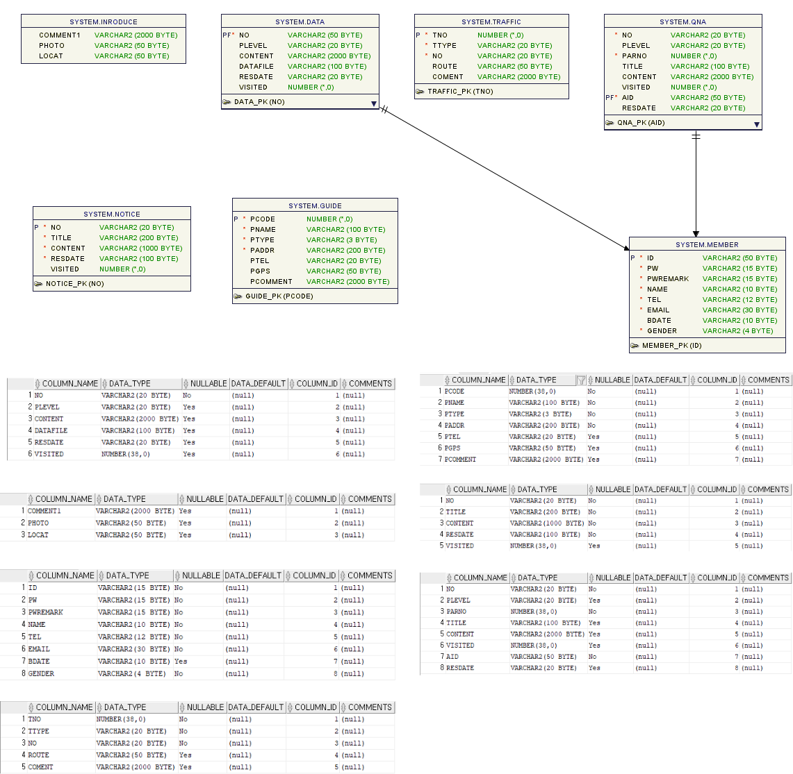

# 프로젝트 개발 보고서(Project Development Report)
------------------------------------------------
## 1. Project Outline(프로젝트 개요)
    사는 곳 말고 여행을 간다면 이라는 주제로 시작되었다. 경포동에 한하는 것이 아니라 
    그 인근, 나아가 강릉이라는 지역에 대한 소개가 밑바탕이 된 이유이다.  
    어쨌거나 서두에 이야기 했듯이 필자는 강릉이라는 곳에서 몇 년간 살아봤던 
    경험이 있기에, 필자의 경험을 일부 추가하여 간략히 꾸며 보았다.

 

## 2. poject Purpose(프로젝트 목적)
    경포동의 유래와 동네 특징, 그리고 곳곳에 산재되어있는 문화재나 볼거리, 먹거리 등을 공유하기 위해 만들게 되었다.

 

## 3. 프로젝트 개발 환경 정보(Project Development Envurinment)
    Project Topic : Gangreung Gyungpo-dong intro Web Application
    Develope Envirionment : Open JDK 11
    Language : Java 11
    Web Module : Jsp/Servlet3.0
    Process Pattern : MVC Pattern
    Database System(DBMS) : Oracle 21C XE
    Database Design : SQL Developer 23.1.1
    Entity Relationship Design : draw.io 20.8.16
    Java Database Connector : ojdbc11
    Application Design : Object aid 1.2.4
    Back Template Language : Java/Servlet 11
    Front Template Language : Jsp(JSTL/EL) 3.0 / HTML5 / CSS3 / Javascript ES5
    Web(Application) Server : Tomcat 9.0
    Navigation Design : WordClod 3.7, Card Sort BoardMix

 

## 4. 프로젝트 기획 및 설계(Project Planning & Design)

### 4-1. 네비게이션 설계(Navigation Design)
| 마이페이지 | 공지사항 | 지역소개 | 회원참여 |
|-----------|-----------|-----------|-----------|
| 로그인 | 사이트 소개 | 경포동 소개 | 자유게시판 |
| 나의 정보 | 교통편 소개 | 볼거리 소개 | 자료실 |
| 개인정보처리방침 | 문화센터 소개 | 맛집 소개 | &nbsp; |
| 회원가입 | &nbsp; | 숙박시설 안내 | &nbsp; |

 

#### 4-1-1. 자료 수집

 

#### 4-1-2. 콘텐츠 분류

 

#### 4-1-3. 서비스 흐름 설계

 

#### 4-1-4. 서비스 시나리오

    **사용자 시나리오**
    1. 지역 소개인 지명 유래와 연혁을 탐색한다.
    1. 지역 소개인 지역 특징 및 시설 안내를 탐색한다.
    2. 해당 지역의 지도가 궁금하여 오는 길을 탐색한다.
    3. 해당 지역의 교통편을 알아보고, 방문을 계획 한다.
    4. 사용자는 어디 어디에 방문할지 주요 빌딩과 주요 협회, 맛집 등을 확인한다.
    5. 해당 지역의 이벤트나 특이사항을 확인하기 위하여 공지사항의 글을 확인한다.
    6. 사이트 내에서 공지사항의 글 확인과 질의 응답이나 기타 정보교환을 위하여 회원가입을 시작한다.
    7. 회원가입을 시작하게 되면, 회원 약관 및 개인정보처리 방침에 동의하도록 한다.
    8. 회원 가입 페이지에서 필수 정보를 입력하고, 아이디의 중복확인을 거쳐 회원가입을 완료하도록 한다.
    9.  회원 가입 후 로그인 하여 공지사항 열람권한과 자유게시판 이용권한을 획득한다.
    10. 공지사항의 글을 확인하고, 해당 정보가 없는 경우 궁금한 사항을 질문하기 위해 자유게시판으로 이동한다.
    11.  질문을 등록한다.
    12.  카탈로그나 가이드가 있는지 확인하기 위해 자료실을 탐색한다.
    13.  해당 자료가 있음을 확인하고, 자료를 다운로드 한다.

 
    
    **관리자 시나리오**
    1. 관리자 아이디로 로그인한다.
    2. 공지사항 목록을 확인하고, 누락된 정보가 있는지 확인한다.
    3. 해당 지역의 이벤트나 특이사항을 공지사항으로 등록하도록 한다.
    4. 변동된 내용이 있을 경우 공지사항을 수정하도록 한다.
    5. 이벤트나 특이사항 중에서 취소된 내용이 있어 공지사항 글을 삭제하도록 한다.
    6. 자유게시판 목록으로 이동하여 등록된 질문을 확인하고, 답변 글을 등록한다.
    7. 만약, 스팸 글인 경우나 불필요한 글이 있는 경우에는 해당 글을 삭제한다.
    8. 카탈로그나 가이드가 새롭게 발행된 경우 자료실에 업로드 한다.
    9. 지역 소개에 대한 변동이 있어 해당 페이지의 내용을 수정한다.
    10.  이용안내에 대한 변동사항이 있어 새로운 내용으로 변경한다.
    11.  회원목록으로 이동하여 신규회원이나 탈퇴 회원을 확인하도록 하고, 제적 사유에 해당하는 회원은 강제탈퇴 시킨다.

 

### 4-2. 데이터베이스 설계

#### 4-2-1. 개념적 설계

 

#### 4-2-2. 논리적 설계

 

#### 4-2-3. 물리적 설계

